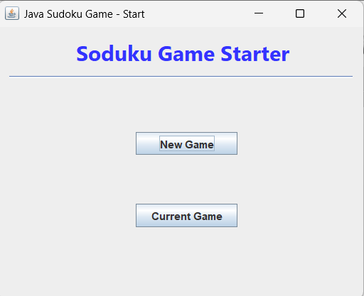
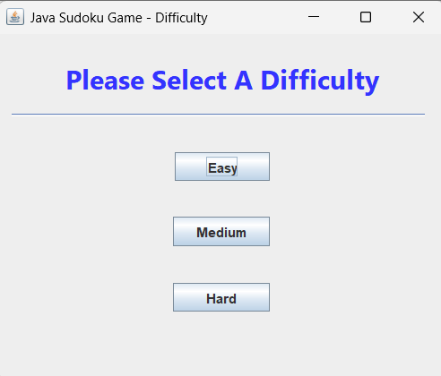
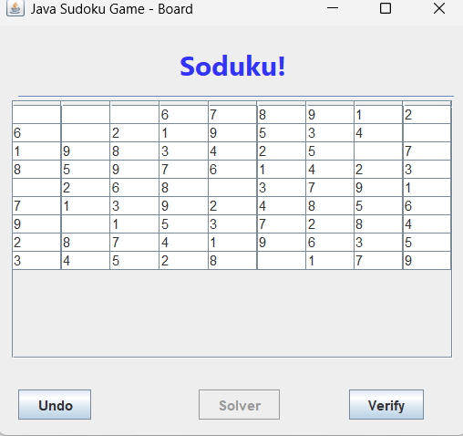
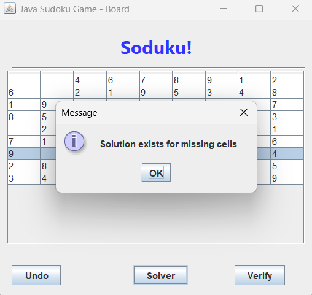
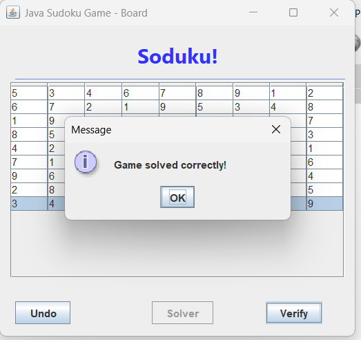
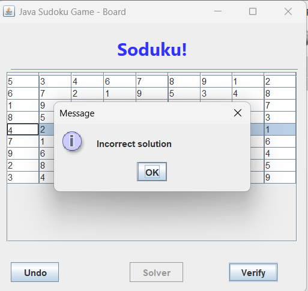

# Java Sudoku Game

A Java-based Sudoku desktop game built using Java Swing and object-oriented programming. The project includes difficulty selection, Sudoku board loading, puzzle interaction, solver support, solution verification, and a structured Model-View-Controller style architecture.

## Project Overview

This project was developed to practice Java software design, GUI development, file handling, and algorithmic problem solving through a complete Sudoku game application.

The application allows users to start a new Sudoku game, choose a difficulty level, interact with a Sudoku board, use solver functionality, and verify whether the current board solution is correct.

## Features

- Java Swing desktop interface
- New game and current game options
- Difficulty selection: Easy, Medium, and Hard
- Sudoku board loading from CSV files
- Interactive Sudoku grid
- Solver functionality for missing cells
- Solution verification
- Correct and incorrect solution feedback
- Undo functionality
- Structured Model, View, and Controller packages
- Object-oriented design using multiple classes and responsibilities

## Technologies Used

- Java
- Java Swing
- Object-Oriented Programming
- File handling
- CSV files
- NetBeans
- Ant build system
- Git and GitHub

## Project Structure

```text
java-sudoku-game/
│
├── src/
│   ├── Controller/        Application control flow and user interaction logic
│   ├── Model/             Sudoku game logic, board loading, validation, and checking
│   └── View/              Java Swing graphical interface
│
├── easy/                  Easy Sudoku board files
├── medium/                Medium Sudoku board files
├── hard/                  Hard Sudoku board files
│
├── screenshots/           Application screenshots
├── nbproject/             NetBeans project configuration
├── build.xml              Ant build configuration
├── manifest.mf            Manifest file
├── valid.csv              Sample valid board file
├── .gitignore
└── README.md
```

## Main Components

### Model

The `Model` package contains the core Sudoku logic, including:

- Board reading
- Game state management
- Row validation
- Column validation
- Box validation
- Duplicate detection
- Difficulty handling
- Board loading
- Solver and verifier logic

### View

The `View` package contains the Java Swing screens used by the player, including:

- Start screen
- Difficulty selection screen
- Sudoku game board
- User action handling
- Validation feedback dialogs

### Controller

The `Controller` package connects the interface with the game logic and manages the flow of the application.

## Screenshots

### Start Screen



### Difficulty Selection



### Game Board



### Solver Result



### Correct Validation Result



### Incorrect Validation Result



## How to Run the Project

### Recommended Method: NetBeans

1. Install Java JDK.
2. Install Apache NetBeans.
3. Clone the repository:

```bash
git clone https://github.com/Youssufathalla/java-sudoku-game.git
```

4. Open NetBeans.
5. Select:

```text
File > Open Project
```

6. Choose the `java-sudoku-game` folder.
7. Right-click the project and select:

```text
Clean and Build
```

8. Click:

```text
Run
```

The application should start from the main game interface.

## Command Line Method

From the project directory, run:

```bash
ant clean jar
```

Then run:

```bash
java -jar dist/java-sudoku-game.jar
```

## How to Use

1. Start the application.
2. Click `New Game`.
3. Select a difficulty level: Easy, Medium, or Hard.
4. Fill in the missing Sudoku cells.
5. Use `Solver` to check if a solution exists for the missing cells.
6. Use `Verify` to check whether the current board is solved correctly.
7. Use `Undo` to reverse the last move if needed.

## What I Learned

- Building a complete Java desktop application
- Applying object-oriented programming to a game project
- Separating responsibilities using Model, View, and Controller-style structure
- Working with Java Swing components
- Reading and processing CSV files
- Implementing Sudoku validation logic
- Managing game state
- Handling user actions through a graphical interface
- Cleaning and publishing a Java project professionally on GitHub

## Future Improvements

- Improve the graphical interface design
- Add a timer
- Add scoring system
- Add hint functionality
- Add automatic Sudoku puzzle generation
- Add unit tests
- Improve exception handling
- Add more puzzle files
- Package the application as an installer

## Author

Youssuf Hatem Fathalla